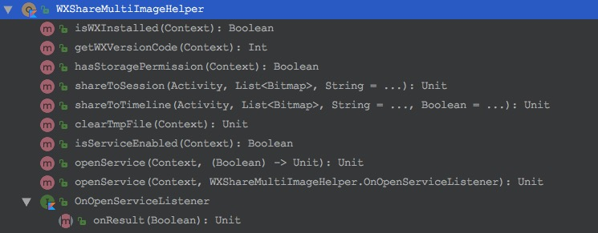

# WXShareMultiImage

基于无障碍服务实现微信多图分享。

[  ](https://bintray.com/shichaohui/maven/wx-share/_latestVersion)

## 功能

* 分享多图+文字给好友。
* 分享多图+文字到朋友圈。

[下载Demo](./demo.apk)

[观看演示视频](http://seafile.meimeifa.com:8000/f/bfaa286abf/?raw=1)

### 微信 v6.7.3 分享步骤

若用户未打开无障碍服务：自动跳转图文分享界面，并提示用户粘贴文字选择图片。

若用户已打开无障碍服务：自动跳转图文分享界面，自动粘贴文字选择图片。

### 微信 v7.0.0 分享步骤

若用户未打开无障碍服务：自动跳转微信，并提示用户打开朋友圈粘贴文字选择图片。

若用户已打开无障碍服务：自动跳转微信，若当前微信处于一级页面（聊天列表、联系人、发现、我），自动打开发现-朋友圈-从相册选择-图文分享-粘贴文字。
若微信处于非一级页面，则需用户手动返回一级页面触发上述流程。


## Gradle 依赖

```groovy
implementation 'com.sch.share:wx-share:1.0.5'
```

## 配置

在 strings.xml 中自定义无障碍服务标签。
```xml
<string name="wx_share_multi_image_service_label">ShareDemo【多图分享】</string>
```

## 权限

由于 SDK 涉及文件操作，请添加相关权限。
```
<uses-permission android:name="android.permission.WRITE_EXTERNAL_STORAGE"/>
<uses-permission android:name="android.permission.READ_EXTERNAL_STORAGE"/>
```

## API

[查看所有 API 。](./wx-share/src/main/java/com/sch/share/WXShareMultiImageHelper.kt)



## 用法：

### 分享给好友

```
/*
 * bitmapList: List<Bitmap> 待分享图片列表。
 * text: String 待分享文案。
 */

WXShareMultiImageHelper.shareToSession(activity, bitmapList)

WXShareMultiImageHelper.shareToSession(activity, bitmapList, text)
```

### 分享到朋友圈

```
/*
 * bitmapList: List<Bitmap> 待分享图片列表。
 * text: String 待分享文案。
 * isAuto: Boolean false 表示由用户手动粘贴文字、选择选图，不会执行无障碍操作；
 *                 true 表示使用无障碍操作，若用户未打开无障碍服务，将和 false 等同。
 *                   默认为 true 。
 */

WXShareMultiImageHelper.shareToTimeline(activity, bitmapList)

WXShareMultiImageHelper.shareToTimeline(activity, bitmapList, text)

WXShareMultiImageHelper.shareToTimeline(activity, bitmapList, text, isAuto)
```
分享时默认 isAuto 为 true，即会尝试使用无障碍服务，若无障碍服务未打开，会弹出提示框引导用户打开服务。
如果不想使用默认的弹窗，可以自行弹窗引导用户打开服务，并将结果作为 `shareToTimeline()` 的 isAuto 参数 。

### 清理临时文件

分享时会产生临时文件，每次分享前都会清理临时所属文件夹，也可以在特定时间调用 API 清理。

```
WXShareMultiImageHelper.clearTmpFile(activity)
```

### 判断无障碍服务是否可用

```
if(WXShareMultiImageHelper.isServiceEnabled(activity)) {
    // do something.
} else {
    // do something.
}
```

### 打开无障碍服务

```
// Kotlin
WXShareMultiImageHelper.openService(activity) {
    // 结果回调，it: Boolean 表示是否打开了无障碍服务。
    isServiceEnabled = it
}

// Java
WXShareMultiImageHelper.openService(activity, new WXShareMultiImageHelper.OnOpenServiceListener() {
    @Override
    public void onResult(boolean isOpen) {
        // do something.
    }
});
```
